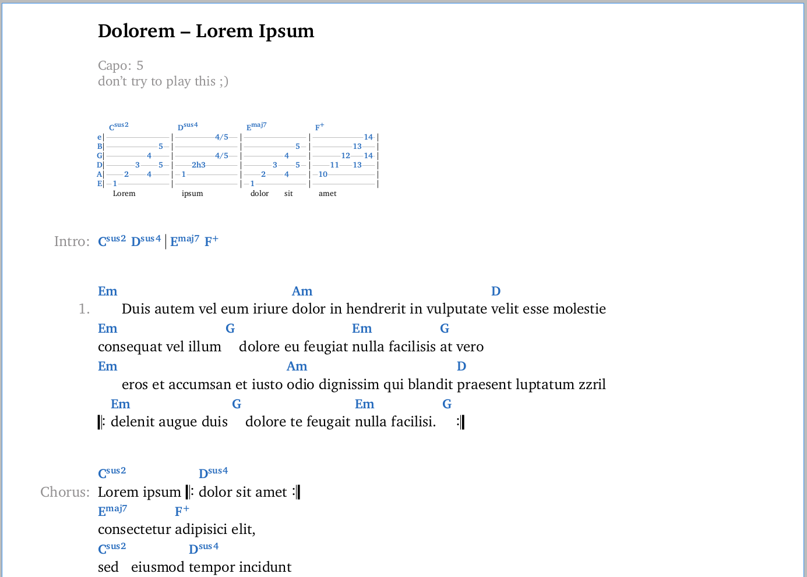
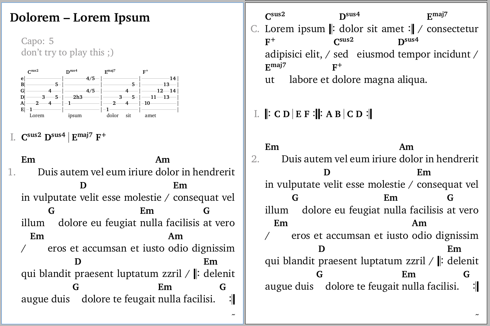

# Songbook Creator

Convert text based chord sheets to LaTeX, making use of the [leadsheets package](https://github.com/cgnieder/leadsheets).
The resulting files can be turned into songbooks with adjustable formatting, utilizing the templating capabilities of the leadsheets package.

The conversion to PDF files works best using [TeX Live](https://www.tug.org/texlive/).

## Workflow

### Add input files

Place multiple text files in the `input` folder:

```txt
input/interpret a - song 1.txt
input/interpret a - song 2.txt
input/interpret b - song 3.txt
```

### Convert input files to LaTeX

Run the conversion script:

```sh
./convert.py input/*
```

A LaTeX file is created in the `songs` folder for each input file:

```txt
songs/interpret a - song 1.tex
songs/interpret a - song 2.tex
songs/interpret b - song 3.tex
```

Additionaly, the latex file `songs.tex` is created which can be used to include all the files from the `songs` folder:

```latex
\input{songs/interpret a - song 1.tex}
\input{songs/interpret a - song 2.tex}
\input{songs/interpret b - song 3.tex}
```

### Convert LaTeX to PDF

Run `xelatex` on one of the songbook files that include the `songs.tex` file.

```sh
xelatex -interactio=nonstopmode -shell-escape -halt-on-error songbook.tex
```

## Example

a simple chordsheet file

```txt
Interpret - Title

[Verse]
Em  Am
abc abc

[Chorus]
Em  B7
abc abc
```

is converted to the following LaTeX file

```latex
% test.txt

% Interpret - Title
\begin{song}{
interpret={Interpret},
title={Title},
}

% [Verse]
% Em  Am
% abc abc
\begin{verse}
\chord{Em}abc \chord{Am}abc
\end{verse}

% [Chorus]
% Em  B7
% abc abc
\begin{chorus}
\chord{Em}abc \chord{B7}abc
\end{chorus}

\end{song}
```

## Features

A 'verse' refers to any 'verse-like' part, e.g. a verse, chorus, bridge, etc.

### Verse Breaks

The `convert.py` script adds the `\versebreak` command at the end of each line in a verse.
It must be defined in the `songbook.tex` file and can just contain a newline:

```latex
\newcommand{\versebreak}{\\}
```

For a more compact layout, a slash or other character can be used:

```latex
\newcommand{\versebreak}{/ }
```

### Repetitions

Repetitions are typeset using music symbol bars and can be explicitly defined in the input files.
In addition, repeating lines within a part and repeating (identical) parts are automatically detected.

These 4 examples lead to the exact same result:

```txt
[Chorus] x2
Em    Am
Lorem ipsum
```

```txt
[Chorus]
   Em    Am
|: Lorem ipsum :|
```

```txt
[Chorus]
Em    Am
Lorem ipsum

[Chorus]
Em    Am
Lorem ipsum
```

```txt
[Chorus]
Em    Am
Lorem ipsum
Em    Am
Lorem ipsum
```

### Tabulatures

Tabulatures are converted into a series of `\makebox` commands which allow for using variable-width fonts in a fixed-width grid.

```
e|--1--2--3--|-----------|
B|-----------|--1--2--3--|
G|-----------|-----------|
D|-----------|-----------|
A|-----------|-----------|
E|-----------|-----------|
```

The following commands and a length must be defined in the `songbook.tex` file.
They control the format of the different tabulature elements:

```latex
\newcommand{\tabformat}{\tiny}
\newcommand{\tabruleformat}{\color{lightgray}}
\newcommand{\tabnoteformat}{\bfseries{}\color{NavyBlue}}
\newcommand{\tabotherformat}{\color{black}}
\newcommand{\tabchordformat}{\tiny\bfseries{}\color{NavyBlue}}

\newlength{\tabcellwidth}
\setlength{\tabcellwidth}{1.0mm}
```

## Variable formatting examples

### Print format

from [songbook.tex](songbook.tex)



### E-Book format

from [songbook-ebook.tex](songbook-ebook.tex)


